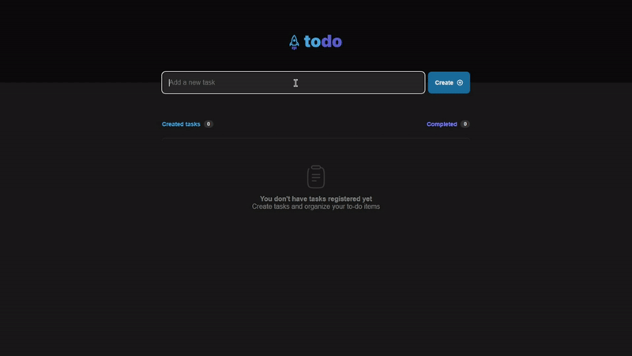

<p align="center">
  
</p>

# [To-Do List](https://todo-list-react-legeannd.vercel.app/)
   


<p align="center">
  
</p>

<p align="center">
  
</p>


* [Content (en-US)](#section-en_us)
* [Conteúdo (pt-BR)](#secao-pt_br)

---

## About the project <a id="section-en_us"></a>

This is a To-Do app made in React and Typescript where the user can add their tasks and complete tasks already created. The app uses the browser's local storage to save the user's tasks and retrieve them later, even if the browser has been closed.

## Content
  * [Techs](#techs)
  * [How to run the project](#installation)
    * [Installation - Frontend](#installation-front)

## Techs <a id="techs"></a>

- [x] React
- [x] Typescript
- [x] Local Storage

## How to execute the project <a id="installation"></a>
To execute the project, you'll need to have Node and NPM or Yarn installed to setup all the dependencies.


### Installation - Front-end (Web) <a id="installation-front"></a>

In the project root folder:

```bash
npm install
npm run dev
```

If you are using Yarn, use this:
```bash
yarn install
yarn dev
```

<!-- Remember to create a .env file to put the enviroment variables exemplified in the .env.example file with your personal data. -->

After finishing installation, the web page will be open in your browser.

---

## Sobre o projeto <a id="secao-pt_br"></a>

Letmeask é uma plataforma para criação de salas de perguntas, onde o usuário pode criar e gerenciar sua sala, além de poder participar de salas criadas por outros usuários, onde é possível criar uma nova pergunta na sala ou curtir mensagens já existentes. As perguntas são criadas em tempo real e são mostradas ao usuário conforme são criadas, devido à funcionalidade de banco de dados em tempo real do Firebase.

## Conteúdos
  * [Tecnologias](#tecnlogias)
  * [Como executar o projeto](#instalacao)
    * [Instalação - Front-end](#instalacao-front)

## Tecnologias <a id="tecnologias"></a>

- [x] React
- [x] Firebase
- [x] Sass

## Como executar o projeto <a id="instalacao"></a>
Para executar o projeto, você irá precisar ter o Node e o NPM ou Yarn instalados para baixar as dependências.


### Instalação - Front-end (Web) <a id="instalacao-front"></a>

Na pasta raíz do repositório:

```bash
npm install
npm run dev
```

Se estiver usando Yarn, utilize
```bash
yarn install
yarn dev
```

Lembre-se de criar um arquivo .env para colocar as variáveis de ambiente exemplificadas no arquivo .env.example com os seus dados pessoais.

Quando terminar, a página da aplicação web será aberta no navegador.

---
###### Developed by [Gean Lucas](https://www.linkedin.com/in/geanlucaas/) :rocket:.